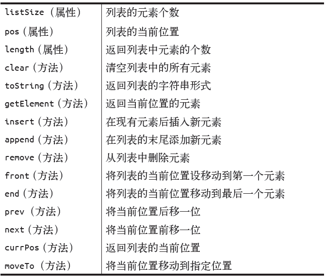

## 列表
1. 列表：列表是一组有序的数据。每个列表中的数据项称为元素。在JavaScript 中，列表中的元素可以是任意数据类型。列表中可以保存多少元素并没有事先限定，实际使用时元素的数量受到程序内存的限制。
2. 列表的抽象数据类型并未指明列表的存储结构，在本章的实现中，我们使用一个数组
dataStore 来存储元素。
3. 列表的完整抽象数据类型定义
;
  列表有前有后（分别对应front 和end）。使用next() 方法可以从当前元素移动到下一个元素，使用prev() 方法可以移动到当前元素的前一个元素。还可以使用moveTo(n) 方法直接移动到指定位置，这里的n 表示要移动到第n 个位置。currPos 属性表示列表中的当前位置。

[实现列表类](./list.js);